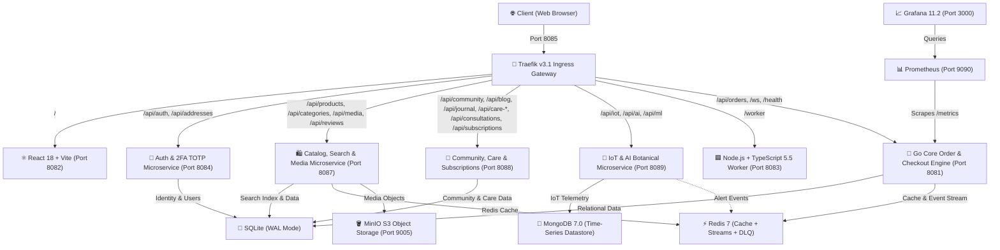

# 🌿 Kather Baksho
### Enterprise-Grade, Resilient Full-Stack Botanical E-Commerce & IoT Platform

> **100% Localhost Enterprise Architecture** built with **Go (Gin + GORM)**, **React 18 (Vite)**, **Node.js & TypeScript 5.5 Microservices**, **Polyglot Persistence (SQLite, Redis, MongoDB 7.0, MinIO S3)**, **Traefik Cloud-Native Ingress Gateway**, **Real-Time Goroutine WebSockets**, **Prometheus & Grafana Observability**, **Atomic Concurrency Control**, **RFC 6238 TOTP 2FA**, and **Chaos Engineering Studio**.

[](https://github.com/iftakhar-323/kather_baksho)
[](https://github.com/iftakhar-323/kather_baksho)
[](https://golang.org)
[](https://www.typescriptlang.org)
[](https://docker.com)
[](https://traefik.io)
[](LICENSE)


> A modern, enterprise-grade, cloud-native botanical e-commerce and smart plant care platform designed with a high-throughput **Event-Driven Microservices Architecture**, polyglot persistence, real-time rider tracking, RFC 6238 TOTP two-factor authentication, and chaos engineering resilience. Built for **100% localhost execution** with zero external cloud fees or paid third-party API dependencies.

---

## 📑 Table of Contents

1. [📖 What is this Project?](#-what-is-this-project)
2. [💡 How it Makes Life Easy & Solves Key Problems](#-how-it-makes-life-easy)
3. [✨ Special & Advanced Implementations](#-special-implementations)
4. [🛠️ Tech Stack & Tools Used](#-tech-stack--tools-used)
5. [🎯 Why Are These Implementations Important?](#-why-important)
6. [🌐 Local Service Map & Running Ports](#-local-service-map--running-ports)
7. [🔐 Seeded Accounts & Credentials](#-seeded-accounts--credentials)
8. [🚀 1-Command Quickstart Guide](#-quickstart-guide)
9. [🧪 Automated Testing & Verification Suite (61/61 Tests)](#-automated-testing--verification)
10. [📁 Project Layout](#-project-layout)

---

<a name="-what-is-this-project"></a>
## 📌 1. What is this Project?

**Kather Baksho** is a high-performance, production-grade e-commerce and botanical care ecosystem designed for plants, gardening supplies, and plant parenting. 

Unlike traditional monoliths or boilerplate demo apps, Kather Baksho is an **end-to-end distributed system** engineered to mirror modern Fortune-500 architectures (event-driven messaging, polyglot persistence, object storage, circuit breakers, chaos fault injection, and real-time stream telemetries)—**engineered to run 100% locally without requiring any paid cloud services or domain names**.

### What's Inside the Application:
- **Customer Storefront**: Fast catalog browsing with instant typo-tolerant search, category filtering, cart operations, multi-address management, wishlist, and product reviews.
- **Admin & Staff Back-Office**: Real-time sales analytics, inventory adjustments, order fulfillment status workflows, and product deduplication.
- **Botanical Care Ecosystem**: Smart IoT garden telemetry monitor, plant watering journals, and consultation bookings.
- **Dual-Mode AI Plant Doctor**: Computer vision & symptom diagnostic engine with automated fallback to a local rule-based botanical knowledge base.
- **Real-Time Courier Radar**: Goroutine-powered live GPS tracking showing simulated delivery couriers navigating Dhaka traffic.
- **Interactive Engineering & Algorithm Studio**: Live visualizers for Dijkstra's delivery routing, Bin-Packing box optimization, ML model benchmarks, and Chaos Engineering fault injection.

---

<a name="-how-it-makes-life-easy"></a>
## 💡 2. How it Makes Life Easy & Solves Key Problems

| Audience | What Made It Difficult Previously | How Kather Baksho Makes It Effortless |
| :--- | :--- | :--- |
| **End Customer** | Slow searches, uncertain delivery times, confusing plant care, manual paper receipts. | **Instant highlighted search** finds items even with typos; **Live Courier Radar** shows delivery progress on a map; **AI Plant Doctor** diagnoses yellow leaves in seconds; **Instant PDF Invoices** download with one click. |
| **Developer / Contributor** | Setting up 10 external cloud accounts (AWS, MongoDB Atlas, Upstash, S3, Brevo, Datadog), recurring subscription bills, complex local setups. | **1-Command Zero-Cost Localhost Execution**: MinIO simulates S3, local Redis handles streams/caching, local MongoDB handles IoT telemetry, pure-Go TOTP eliminates third-party auth services. One `docker compose up -d` starts everything! |
| **Store Operator / Admin** | Overselling products during flash sales, missing invoices, unrecoverable worker crashes, inability to test outages. | **Conditional SQL atomic decrement** prevents overselling (0 oversold items guaranteed); **Dead-Letter Queue** preserves failed jobs; **Chaos Studio** allows stress testing resilience safely on localhost. |

---

<a name="-special--advanced-implementations"></a>
## ⭐ 3. Special & Advanced Implementations

Here are the enterprise-grade features implemented in this repository:

### 1. ⚡ High-Velocity Flash Sale Concurrency Engine (Zero Overselling)
- **Problem**: When 100+ shoppers simultaneously click "Checkout" on the last 5 units, standard databases suffer race conditions and oversell stock.
- **Implementation**: Enforced conditional atomic SQL decrements (`WHERE id = ? AND stock >= ?`) inside transactional blocks.
- **Verification**: Dedicated multi-threaded benchmark (`tests/stress_test.py`) simulating 50 concurrent shoppers competing for 5 items. Result: Exactly 5 succeed, 45 fail gracefully, and database stock ends at precisely 0.

### 2. 🔑 Enterprise Pure-Go RFC 6238 TOTP Two-Factor Authentication (2FA)
- **Problem**: Most apps rely on costly third-party auth services (Auth0, Twilio, Firebase) for 2FA.
- **Implementation**: Pure Go RFC 6238 TOTP engine with zero external dependencies. Compatible with Google Authenticator, Authy, and 1Password.
- **Security Features**: Clock drift skew tolerance (±30s), step-up challenge (`temp_token` with `role: 2fa_pending` blocked from protected routes), and 8 cryptographically secure one-time emergency recovery codes (`XXXX-XXXX`).

### 3. 📨 Event-Driven Architecture & Message Bus (Redis Streams + DLQ)
- **Problem**: Synchronous HTTP calls slow down user checkouts and cause lost data if downstream services fail.
- **Implementation**: Distributed Redis Streams (`kb:events:stream`) with consumer groups (`kb_workers`) and persistent worker daemons.
- **Resilience**: Transient errors retry up to 3 times before routing failed payloads into a Dead-Letter Queue (`kb:events:dlq`) with error diagnostics.

### 4. 🗄️ Local MinIO S3-Compatible Object Storage & Media Processing
- **Problem**: Storing product images on disk causes scaling bottlenecks, while AWS S3 charges bandwidth and storage fees.
- **Implementation**: Containerized MinIO S3 datastore on ports `9005` (S3 API) and `9006` (Web Console).
- **Features**: Multipart upload (`POST /api/media/upload`), SHA256 deduplication, automatic bucket auto-provisioning (`kather-baksho-media`), and in-memory fallback cache.

### 5. 🔍 SQLite FTS5 Full-Text Search Engine with Live Highlights
- **Problem**: SQL `LIKE %query%` queries are slow, cannot rank relevance, and don't highlight matches.
- **Implementation**: Virtual tables powered by SQLite FTS5 with Porter stemming and tokenization.
- **Features**: Typo-tolerant prefix matching (`succ` → `Succulent`) and dynamic `<mark>` tag highlighting around query keywords in names and descriptions.

### 6. 💥 Chaos Engineering & Interactive Resilience Studio
- **Problem**: Real-world networks experience packet drops, latency jitter, and server crashes that are hard to replicate.
- **Implementation**: Runtime thread-safe `ChaosMiddleware` capable of injecting configurable artificial latency (0-2000ms) and random HTTP 503 service outages (0-50%).
- **Interactive UI**: Fourth tab in `/algorithms` featuring live sliders, request counters, circuit breaker health monitor (`CLOSED`, `OPEN`, `HALF-OPEN`), and a 1-click **"Reset to Healthy Baseline"** button.

### 7. 🚀 Node.js & TypeScript Microservice for Vector PDF Rendering
- **Problem**: Generating complex PDF invoices and analytics reports in Go can consume significant CPU and lacks flexible vector layout engines.
- **Implementation**: Dedicated containerized microservice on port `8083` built with Express, TypeScript 5.5, and PDFKit.
- **Bridge**: Go backend proxies `GET /api/orders/:id/invoice/pdf` and `GET /api/analytics/report/pdf` directly to the TypeScript worker.

### 8. 🌱 Polyglot Persistence & MongoDB 7.0 IoT Botanical Telemetry
- **Architecture**:
  - **SQLite (WAL mode)**: Relational transactional data (users, orders, products, reviews).
  - **Redis 7**: High-speed caching, rate-limit token buckets, and event streaming.
  - **MongoDB 7.0**: Unstructured time-series IoT plant telemetry (soil moisture, temperature, sunlight lux, pH).
  - **MinIO S3**: Binary image and media asset storage.
- **Automated Health Probe**: Deep readiness check (`/health/ready`) verifying all four datastores simultaneously.

### 9. 🛵 Real-Time Goroutine WebSockets & Delivery Rider Radar
- **Implementation**: Pure-Go goroutine streaming live courier GPS coordinates across Dhaka milestones (Mirpur Hub → Mirpur 10 → Agargaon → Bijoy Sarani → Doorstep).
- **Frontend Radar UI**: Live radar screen in customer order details showing animated pulsing checkpoint markers, speedometers, and Dijkstra ETA countdowns.

### 10. 🔀 Traefik Cloud-Native Ingress Edge Proxy
- **Unified Gateway**: Traefik v3.1 on port `8085` routes all traffic (`/` to Frontend, `/api/auth` to Auth Microservice, `/api/products` to Catalog Microservice, `/api/iot` to IoT Microservice, `/worker` to TS Worker, `/ws` to WebSockets).
- **Live Dashboard**: Real-time traffic inspection on port `8086/dashboard/`.

### 11. 🛍️ Autonomous Botanical Catalog, Search & Media Microservice
- **Domain Decoupling**: Dedicated microservice running on port `8087` (`services/catalog-service`) handling product inventory, categories, BM25 FTS5 typo-tolerant search, MinIO S3 media upload/serving, and reviews.
- **Resilient Fallback**: Integrated Strangler Fig reverse proxy pattern in core backend ensures 100% backward compatibility for existing scripts and legacy tests.

### 12. 🔐 Autonomous Identity, 2FA TOTP & User Management Microservice
- **Domain Decoupling**: Dedicated microservice running on port `8084` (`services/auth-service`) managing user registration, authentication, pure-Go RFC 6238 TOTP 2FA, customer addresses CRUD, and Admin RBAC.
- **Stateless JWT Claims**: Distributed shared-secret stateless JWT verification eliminates cross-service DB query bottlenecks while keeping user security boundaries airtight.

### 13. 🌱 Autonomous Community, Botanical Care & Subscriptions Microservice
- **Domain Decoupling**: Dedicated microservice running on port `8088` (`services/community-care-service`) managing community social discussions, Q&A forums with accepted answers, social gardening groups, user follows, and bookmarks.
- **Botanical Parenting & Care**: Botanical growth journal with photo logs, seasonal monthly care schedules, and aggregated multi-plant care calendars.
- **Care Subscriptions & Consultations**: Automated plant delivery subscriptions (pause, resume, manual renewal) and botanical expert consultation bookings.

---

<a name="-tech-stack--tools"></a>
## 🛠️ 4. Tech Stack & Tools Used



| Layer | Technology | Purpose in Project |
| :--- | :--- | :--- |
| **Order & Checkout Engine** | **Go 1.22+ (Gin, GORM)** | Core checkout transaction engine, WebSocket rider radar, flash sale atomic locking, and coupons. |
| **Catalog & Search Service** | **Go 1.22+ Microservice** | Autonomous catalog, BM25 FTS5 search, category management, and MinIO S3 media pipeline. |
| **Auth & Identity Service** | **Go 1.22+ Microservice** | Autonomous user management, RFC 6238 TOTP 2FA, customer addresses, and Admin RBAC. |
| **Community & Care Service** | **Go 1.22+ Microservice** | Autonomous community forums, botanical care journals, expert consultations, and subscriptions. |
| **IoT & AI Microservice** | **Go 1.22+ Microservice** | Autonomous plant sensor telemetry ingestion, alert dispatch, AI diagnostics & ML benchmarking. |
| **Worker Service** | **Node.js 20, TypeScript 5.5, PDFKit** | Vector PDF invoice generation and executive analytics reporting microservice. |
| **Frontend SPA** | **React 18, Vite, React Router v7** | Modern responsive storefront, admin back-office, and interactive studios. |
| **API Gateway** | **Traefik v3.1 (Cloud-Native Proxy)** | Unified ingress routing, correlation ID propagation, WebSocket upgrades, and live telemetry. |
| **Primary Relational DB**| **SQLite (WAL Mode) + FTS5** | Transactional records, full-text search indexing, and foreign key integrity across microservices. |
| **Cache & Event Bus** | **Redis 7 (Alpine)** | Read-through caching, rate limiter token buckets, and Redis Streams message bus. |
| **IoT Telemetry DB** | **MongoDB 7.0 Community** | Polyglot document and time-series datastore for soil, heat, and lux sensors. |
| **Object Storage** | **MinIO (S3-Compatible)** | Local high-speed media storage replacing AWS S3 for product images. |
| **Observability** | **Prometheus 2.54 + Grafana 11.2** | Automated metrics collection and pre-provisioned executive dashboard. |
| **API Documentation** | **OpenAPI 3.0.3 + Swagger UI** | Self-documenting API schemas and browser-based interactive test console. |
| **Infrastructure-as-Code**| **Terraform + Bash** | Complete AWS EC2 VPC, Subnet, and Security Group provisioning templates. |


---

<a name="-why-important"></a>
## 🎯 5. Why Are These Implementations Important?

1. **Zero Financial Overhead (100% Local Cost Savings)**:
   - Typical cloud startups spend \$200-\$800/month on AWS S3, Redis Cloud, MongoDB Atlas, Auth0, and Datadog.
   - Kather Baksho runs every single capability locally via Docker Compose with zero cloud invoices.

2. **Bulletproof Reliability (ACID & Fault Tolerance)**:
   - **No Overselling**: Flash sales cannot sell inventory that does not exist.
   - **No Lost Messages**: If the invoice or notification worker crashes, Redis Streams and the Dead-Letter Queue guarantee messages are safely persisted and retryable.
   - **No Cascading Failures**: Circuit breakers automatically cut off failing external dependencies, preventing thread starvation.

3. **Enterprise Security & Zero-Trust Auth**:
   - Industry-standard RFC 6238 TOTP protects administrator and customer accounts against password credential stuffing.
   - Token-bucket rate limiting prevents brute-force login attempts and DDoS denial-of-service.

4. **Realistic Engineering Portfolio**:
   - This is not a simple CRUD app. It demonstrates real architectural mastery: distributed systems, asynchronous event streaming, polyglot databases, and chaos resilience.

---

<a name="-local-service-map--running-ports"></a>
## 🌐 6. Local Service Map & Running Ports

When the stack is running, all services are accessible on your local machine:

| Component | Local URL / Port | Technology | Purpose | Private Datastore | Default Auth |
| :--- | :--- | :--- | :--- | :--- | :--- |
| **Traefik Gateway (Primary Entry)** | [http://localhost:8085](http://localhost:8085) | Traefik v3.1 | Primary edge router for all frontend, API, worker & WebSockets | Gateway Config | Direct |
| **Traefik Dashboard** | [http://localhost:8086/dashboard/](http://localhost:8086/dashboard/) | Traefik UI | Live routing table, middleware inspection & traffic counters | Memory | Direct |
| **Storefront Web App** | [http://localhost:8082](http://localhost:8082) | React 18 SPA | Storefront, Admin Panel, AI Plant Doctor & Chaos Studio | Static Files | Public |
| **Order & Fulfillment Microservice** | [http://localhost:8081](http://localhost:8081) | Go 1.22 Gin | Orders, Checkout, Cart, Payment, Coupons, WS Radar | `/app/data/orders.db` | JWT / Session |
| **Identity & 2FA Microservice** | [http://localhost:8084](http://localhost:8084) | Go 1.22 Gin | User Registration, Login, RFC 6238 TOTP 2FA, Addresses | `/app/data/auth.db` | Public / JWT |
| **Botanical Catalog Microservice** | [http://localhost:8087](http://localhost:8087) | Go 1.22 Gin | Products, Categories, FTS5 Search, MinIO Media, Wishlist | `/app/data/catalog.db` | Public / Admin |
| **Community & Care Microservice** | [http://localhost:8088](http://localhost:8088) | Go 1.22 Gin | Community Forums, Care Journals, Subscriptions, Consultations | `/app/data/community.db` | Public / JWT |
| **IoT & AI Intelligence Microservice** | [http://localhost:8089](http://localhost:8089) | Go 1.22 Gin | Autonomous plant sensor telemetry, AI doctor & ML comparisons | MongoDB `kather_baksho_iot` | Public / JWT |
| **Interactive Swagger UI** | [http://localhost:8085/docs](http://localhost:8085/docs) | OpenAPI 3.0 | Complete interactive API explorer with parameter schemas | Memory | Direct |
| **TypeScript Worker Microservice** | [http://localhost:8083](http://localhost:8083) | Node.js + TS | Microservice for PDF invoice and analytics report generation | Stateless | Inter-service |
| **MinIO S3 API** | [http://localhost:9005](http://localhost:9005) | MinIO S3 | AWS S3-compatible object storage API | Object Store | `kather_baksho_admin` / `kather_baksho_s3_secret` |
| **MinIO S3 Web Console** | [http://localhost:9006](http://localhost:9006) | MinIO Console | Visual browser for media buckets and upload inspection | Object Store | `kather_baksho_admin` / `kather_baksho_s3_secret` |
| **MongoDB IoT Datastore** | `localhost:27019` | MongoDB 7.0 | Sensor readings, time-series moisture and lux telemetry | MongoDB 7.0 | Direct |
| **Redis Cache & Streams Bus** | `localhost:6380` | Redis 7 Alpine | In-memory read-through cache & Redis Streams event queue | Redis Memory | Direct |
| **Prometheus Exporter** | [http://localhost:9090](http://localhost:9090) | Prometheus | Automated scraping of `/metrics` (latencies, counts, gauges) | TSDB | Direct |
| **Grafana Observability Portal** | [http://localhost:3000](http://localhost:3000) | Grafana 11.2 | Real-time dashboards monitoring throughput, RPS & p99 delay | Grafana DB | `admin` / `admin` |

---

<a name="-seeded-accounts--credentials"></a>
## 🔐 7. Seeded Accounts & Credentials

The system comes pre-seeded with test accounts representing different authorization roles:

| Role | Email | Password | Privileges & Seeded Features |
| :--- | :--- | :--- | :--- |
| **Super Admin** | `admin@kather_baksho.com` | `Admin@12345` | Full access to `/admin` back-office, catalog management, approvals, analytics, and chaos controls. |
| **Staff Member** | `staff@kather_baksho.com` | `Staff@12345` | Order processing and return fulfillment dashboard access. |
| **Customer** | `customer@test.com` | `Customer@12345` | Seeded with past orders, subscriptions, wishlist, care journal, and Gold loyalty tier. |
| **Alternative Customer** | `iftakhar@gmail.com` | `Customer@12345` | Clean customer profile for checkout testing. |

---

<a name="-1-command-quickstart"></a>
## 🚀 8. 1-Command Quickstart

### Prerequisites
- [Docker Desktop](https://www.docker.com/products/docker-desktop/) or Docker Engine 24+ & Docker Compose v2.
- Python 3.9+ (for running automated tests).

### Start the Entire Stack
Clone the repository and launch all 13 containerized services with a single command:

```bash
git clone https://github.com/iftakhar-323/kather_baksho.git
cd kather_baksho
docker compose up -d --build
```

Within ~30 seconds, all 13 containers will be healthy and accessible at `http://localhost:8085`!

To stop the containers:
```bash
docker compose down
```

---

<a name="-automated-testing--verification"></a>
## 🧪 9. Automated Testing & Verification Suite (64/64 Tests)

### 1. Complete End-to-End Regression Suite (64 Tests)
Tests all 13 microservices, databases, authentication, event streams, FTS5 search, S3 storage, 2FA, and chaos injection:

```bash
python3 tests/e2e_test.py
```

**Results (100% Pass Rate):**
```
Starting E2E test suite...
[✓] Health / Get Products
[✓] Login Admin
[✓] Login Staff
[✓] Register User
[✓] User Me
[✓] Update Profile
[✓] Addresses CRUD
[✓] Cart Operations & Stock Reservation
[✓] Coupon Validate & Apply
[✓] Checkout Order
[✓] Stock Retention After Checkout
[✓] Get Orders & Detail
[✓] Order Invoice & Receipt
[✓] Wishlist CRUD
[✓] Reviews CRUD
[✓] Consultations Booking
[✓] Subscriptions Booking
[✓] Growth Journal CRUD
[✓] Community Posts (Public & Auth)
[✓] Admin Cancel Order & Stock Restoration
[✓] Admin Analytics
[✓] Admin Users List
[✓] Admin Product CRUD (Unique Slug & Deduplication)
[✓] Admin Confirm Consultation
[✓] Categories API
[✓] Blog API & Article Detail
[✓] Security Boundary (Admin Protection)
[✓] Frontend SPA Routing & Fallback
[✓] SQLite Database PRAGMA Integrity Check
[✓] Prometheus Metrics Exposition
[✓] Enhanced Health Readiness Probe
[✓] Idempotency Key Replay Verification
[✓] Payment Session & HMAC Signature Callback
[✓] AI Plant Doctor Symptom Diagnosis
[✓] AI Plant Doctor Conversational Q&A
[✓] ML Model Comparison Benchmark
[✓] Algorithm Studio Visualizer Route
[✓] Redis Read-Through Caching & Cache-HIT
[✓] Redis Cache Invalidation on Admin Mutation
[✓] Multi-Database Health & Readiness Probe
[✓] Node.js & TypeScript Worker Health Probe
[✓] Node.js & TypeScript Direct PDF Generation
[✓] Go Backend PDF Invoice Proxy
[✓] Go Backend Analytics Executive Report PDF
[✓] MongoDB Tri-Database Readiness Probe
[✓] MongoDB IoT Telemetry Ingestion & Alerting
[✓] MongoDB Monitored Plants Snapshot
[✓] MongoDB IoT Telemetry Time-Series History
[✓] Traefik Ingress Routing (Frontend, API & Worker)
[✓] Traefik Live Dashboard & Telemetry API
[✓] WebSocket Real-Time Order & Rider Tracking
[✓] OpenAPI 3.0 Specification & Interactive Swagger UI
[✓] Frontend TypeScript Type Declarations & Config
[✓] AWS EC2 Infrastructure-as-Code & Deployment Orchestration
[✓] Redis Streams Event-Driven Architecture & Message Bus
[✓] SQLite Full-Text Search (FTS) & Highlight Snippets
[✓] Local MinIO S3 Object Storage & Media Pipeline
[✓] Enterprise RFC 6238 TOTP Two-Factor Authentication
[✓] Chaos Engineering & Resilience Studio (Fault Injection & Circuit Breakers)
[✓] Dedicated IoT & AI Botanical Intelligence Microservice
[✓] Automated Concurrency & Stress Testing Benchmark (Flash Sale Simulator)
[✓] Autonomous Catalog, Search & Media Microservice
[✓] Autonomous Identity, 2FA TOTP & User Management Microservice
[✓] Autonomous Community, Botanical Care & Subscriptions Microservice

==================================================
Summary: 64 tests run, 64 passed, 0 failed. (100% Pass Rate)
==================================================
```


### 2. High-Concurrency Flash Sale Stress Benchmark
Simulates race condition attacks where multiple shoppers compete for limited stock:

```bash
python3 tests/stress_test.py --concurrency 50 --stock 5
```

```
======================================================================
🔥 KATHER BAKSHO FLASH SALE CONCURRENCY BENCHMARK
======================================================================
  API Base URL:   http://localhost:8081/api
  Competitors:    50 concurrent threads
  Limited Stock:  5 units available
----------------------------------------------------------------------
📊 BENCHMARK METRICS SUMMARY
  Total Requests:         50
  Successful Checkouts:   5 (Expected: 5)
  Rejected (Out-of-Stock):45 (Expected: 45)
  Final Product Stock:    0 units (Expected: 0)
  Oversold Stock Units:   0
  Throughput:             192.1 req/sec
  Latency p50 (Median):   93.40 ms
  Latency p99:            125.03 ms
----------------------------------------------------------------------
✅ PASS: 100% ACID Atomicity Confirmed. ZERO Overselling!
======================================================================
```

### 3. Backend Go Unit Tests
```bash
cd backend && go test -v ./...
```

---

<a name="-project-layout"></a>
## 📁 10. Project Layout

```
kather_baksho/
├── backend -> services/order-service   # Backward-compatibility symlink for local scripts
├── frontend/                           # React 18 + Vite SPA with TypeScript Types
│   ├── src/
│   │   ├── components/                 # SmartGardenMonitor, LiveDeliveryRadar, GlobalSearch
│   │   ├── pages/                      # Storefront, Admin, Cart, Care, AlgorithmVisualizer (Chaos)
│   │   ├── types/                      # Strict TypeScript declarations (*.d.ts)
│   │   └── App.jsx                     # Routing, layout shell & global context providers
│   ├── tsconfig.json                   # TypeScript compiler config
│   └── nginx.conf                      # Production SPA reverse proxy
├── services/
│   ├── order-service/                  # Core Orders, Cart, Payment, Coupons, WS Radar (Go)
│   ├── auth-service/                   # Identity, RFC 6238 TOTP 2FA & User Management (Go)
│   ├── catalog-service/                # Botanical Catalog, FTS5 Search & MinIO Media (Go)
│   ├── community-care-service/         # Community Forums, Care Journals & Subscriptions (Go)
│   ├── iot-ai-service/                 # Botanical Intelligence & IoT Telemetry (Go)
│   └── worker-ts/                      # Document Generation Microservice (Node.js 20, TypeScript 5.5)
│       └── src/                        # Vector PDF invoice & sales report generators
├── monitoring/
│   ├── traefik/                        # Traefik v3.1 dynamic routing configuration
│   ├── prometheus/                     # Prometheus scrape configuration
│   └── grafana/                        # Pre-provisioned dashboards & datasource
├── scripts/
│   └── split_databases.py              # Automated database-per-service isolation tool
├── infra/
│   └── terraform/                      # AWS EC2, VPC, Subnet, Security Groups IaC
├── deploy/
│   └── ec2-setup.sh                    # 1-Click production Ubuntu automation script
├── tests/
│   ├── e2e_test.py                     # Comprehensive 64-test automated E2E test suite
│   └── stress_test.py                  # Flash Sale concurrency benchmark engine
├── docker-compose.yml                  # 13-Container local microservices orchestration stack
└── README.md                           # ← You are here!

```

---

## 📄 License
This project is licensed under the **MIT License**. Crafted with passion for engineering excellence and plant lovers in Bangladesh 🇧🇩.
